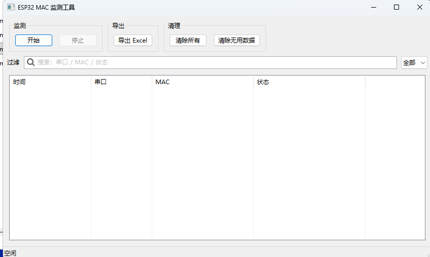
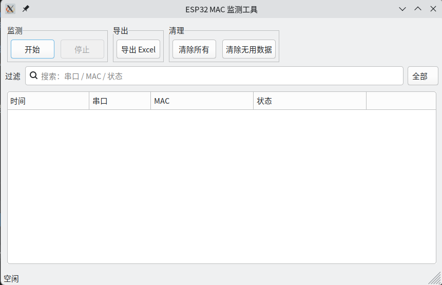

# ESP32 MAC 监测工具

一个轻量的桌面工具：自动发现 ESP32 串口设备、读取 MAC 地址，并可一键导出 Excel。

## 功能特性

- 实时扫描串口，新设备自动读取 MAC
- 记录时间、串口、MAC、状态
- 支持搜索与状态过滤
- 一键导出 `.xlsx` 表格
- 支持 Windows / Linux / macOS（需在对应系统打包）

## 截图

***Windows***



***Linux***



## 依赖

- Python 3.10+（推荐 3.11+）
- wxPython
- pyserial
- esptool
- openpyxl

## 安装

```bash
python -m venv .venv
source .venv/bin/activate
pip install -r requirements.txt
```

## 运行

```bash
python main.py
```

## 使用说明

1. 点击“开始”，程序每秒扫描串口
2. 发现新设备后自动读取 MAC 并记录
3. 使用顶部搜索与“成功/失败”过滤
4. 点击“导出 Excel”保存数据

## 打包

注意：必须在目标系统本机打包，不支持交叉打包。

```bash
python build.py
```

产物位置：

- 构建中间文件：`build/`
- 可执行文件：`bin/esp32_mac_monitor_YYYYMMDD_HHMMSS(.exe)`

## 常见问题

**Q: Windows 下检测时弹出黑窗口？**  
A: 已使用 `esptool` 的 Python API 读取 MAC，不会弹出额外窗口。

**Q: 读取失败怎么办？**  
A: 请确认串口权限、波特率、线缆质量，以及设备是否处于可读状态。
